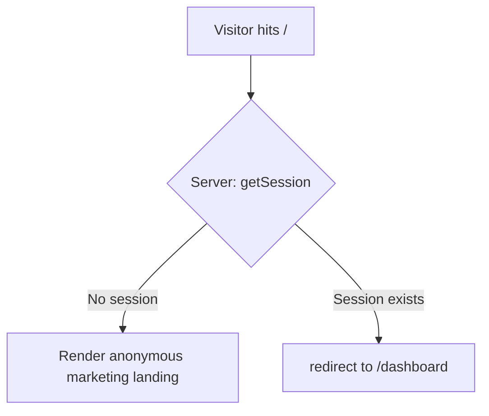

# Donor-ready landing page

## Overview

Bring the public landing page (`app/page.tsx`, the `/` route) to a **donor-ready** state in three layers: (1) finish the **floor** — make it scope-honest and structurally correct; (2) wire the locked **brand identity** (Oravan serif wordmark + lone-O favicon), which fixes live icon 404s; (3) a design **ceiling** pass that extends the already-locked "calm neutral editorial" system (bill-detail + V4 feed card) onto the landing. The landing's job is to convert anonymous visitors → signup **and** read as serious/credible to a donor scanning it for ten seconds.

This plan deliberately **inherits** the locked design language rather than inventing a landing-specific one, and it treats the in-flight floor-pass draft already sitting in `app/page.tsx` as the baseline to build from.

## Problem Frame

The landing is the public front door of a pre-MVP, privacy-first, non-partisan civic-engagement app that helps U.S. voters contact their **federal** representatives. The core product loop is **built and working** (account → rep lookup → bill feed with Decoded summaries → AI script → one-tap call → impact), so signup leads to a real product — this is **not** a waitlist page.

A floor pass is already drafted (uncommitted) in `app/page.tsx`: it scope-corrected copy to federal-only, dropped the out-of-MVP "state & local" and "Callenge" gamification cards, swept `slate-*`→`ink`, converted emoji→lucide, and introduced serif headings. Research (4 agents) confirms the remaining gaps are narrower and more specific than a from-scratch redesign:

- **Scope-honesty:** one feature card still advertises web-push "Alerts" — a feature explicitly **deferred post-MVP** (zero build). Advertising it on a donor page is an over-claim and a launch-gate item.
- **Structural/flow gaps:** a logged-in user hitting `/` is shown the anonymous "Get started free" page; footer Privacy/Terms/Contact are dead `<span>` placeholders (also a signup-flow compliance gap); no Playwright test guards the page.
- **Brand:** every "Oravan" renders as plain bold text; the locked wordmark/mark SVGs sit unused in `assets/brand/` (outside `public/`); the PWA manifest points at `/icons/icon-192.png` + `/icons/icon-512.png` that **don't exist** (live 404s); `app/layout.tsx` wires no favicon.
- **Ceiling:** the page is on-token but has not had a ceiling pass to the bill-detail quality bar (editorial serif voice, accumulate-warmth-from-small-moves, accent-decided-per-screen).

## Requirements Trace

- **R1 — Scope-honest copy.** The landing advertises only built / in-MVP features. No web-push "Alerts", no state/local reps, no gamification, no email-to-reps, no SMS. (Donor trust + the `landing-copy-out-of-scope-features` launch gate.)
- **R2 — Authenticated-visitor handling.** A logged-in visitor to `/` is not shown the anonymous nav/CTAs; they are redirected to `/dashboard`.
- **R3 — Functional legal links.** Footer (and the duplicate signup-page) Privacy / Terms / Contact resolve to real targets, not dead placeholders.
- **R4 — Brand identity wired.** The locked serif wordmark renders on the landing (nav + footer); the lone-O mark is wired as favicon/app-icon; the live manifest icon 404s are fixed. All colors on-token.
- **R5 — Brand quality bar.** The landing reaches the bill-detail ceiling bar — calm neutral editorial, Instrument Serif voice, tokens-only, accent-decided-per-screen — produced via the floor→ceiling workflow.
- **R6 — Accessibility & performance.** WCAG 2.2 AA (contrast, single `<h1>`, ordered headings, visible focus, reduced-motion, decorative icons hidden) and healthy Core Web Vitals, verified in **WebKit + Chromium at 390px and desktop**.
- **R7 — Test coverage.** A Playwright happy-path covers the landing (renders, CTAs resolve, authed redirect, and a scope-regression guard).
- **R8 — Constraints.** `noindex` robots block stays; `FEATURES.md` §6 reconciliation is out of scope; tokens-only (no arbitrary bracket values); feature branch → PR, never `main`.

## Scope Boundaries

- **Do not remove the site-wide `noindex` robots block** (`app/layout.tsx`) — it is a separate launch gate tied to trademark clearance (`deferred.md#noindex-pre-launch`). A donor *demo* is not public launch.
- **Do not pivot to a waitlist** — the product is functional; signup → real onboarding/app.
- **No new external services or env vars.** Brand wiring is asset/markup only.
- **No real legal copy authored here.** The `/privacy` + `/terms` routes are stood up with interim/placeholder content; the actual legal text needs legal review (see Deferred).
- **Tokens only.** No arbitrary bracket values; the only sanctioned one system-wide is `max-w-[65ch]`. New type-scale needs become real token steps, not `text-[17px]`.

### Deferred to Separate Tasks

- **`FEATURES.md` §6 web-push reconciliation** — `FEATURES.md` still lists Web Push as MVP while `deferred.md` deferred it (2026-06-05). Follow `deferred.md` for the landing copy; reconciling the scope doc itself is a separate gated follow-up (`deferred.md#web-push-deferred-post-mvp`). Do not fold into this PR.
- **App-wide wordmark swap** — `components/NavBar.tsx`, `app/(app)/onboarding/page.tsx`, and the four `app/(auth)/*` pages also render plain-text "Oravan". Swapping them to the wordmark component is a natural follow-up but is outside the landing's literal scope; surface as its own step.
- **Residual `slate-*` sweep** — `app/(app)/bills/page.tsx`, `bills/[id]/page.tsx`, `components/ImpactMetrics.tsx`, `components/RepCard.tsx` still carry `slate-*` (`deferred.md#consolidation-followup-offscope-slate-and-semantic-colors`). Not the landing.
- **Real Privacy/Terms legal content** — needs legal review; this plan only stands up the routes + links.

## Context & Research

### Relevant Code and Patterns

- `app/page.tsx` — the landing (in-flight floor-pass draft is the baseline). Structure: nav → hero → social-proof strip → how-it-works (3 steps) → features grid (6 `<Card>`s) → final CTA → footer. The `FEATURES[3]` "Alerts when it counts" / `Bell` card (the web-push over-claim) is the scope bug.
- `proxy.ts` — `PUBLIC_ROUTES` includes `/`; this is where `/privacy` + `/terms` must be added. `/` renders standalone (outside `app/(app)/layout.tsx`, so no `NavBar`).
- `app/(app)/layout.tsx` and `app/(app)/dashboard/page.tsx` — the server `getSession()` + `redirect()` pattern to mirror for R2.
- `tailwind.config.ts` — the token cage: `ink`/`signal`/`paper`(`DEFAULT`/`dark`/`mid`)/`divider`/`card` scales; `fontSize` type scale (`display`/`h1`/`h2`/`h3`/`body`/`small`/`meta`/`mono`); `font-serif` = Instrument Serif; radii (`lg`/`xl`/`pill`); `shadow-*`; transition tokens. `app/globals.css` — base `h1/h2`→serif, `.text-balance`, focus-visible, reduced-motion guards.
- `components/ui/button.tsx`, `components/ui/card.tsx` — consume these (do not copy their internal bracket-value debt into page markup). Note `<Card>` uses off-token `rounded-2xl`; the ceiling should prefer the on-token `rounded-xl` surface used by `BillCard` V4 / the Decoded hero.
- `docs/DESIGN_DECISIONS.md` — the quality bar to inherit: the **bill-detail ceiling** (neutrals-only, serif `text-h2` masthead label over a `divider-strong` hairline, `bg-paper-dark shadow-md rounded-xl`, generous air, `~65ch` measure, softened `ink-85` body) and the **V4 feed-card** hover/focus/transition recipe (`transition-[border-color,box-shadow] duration-component ease-standard hover:border-divider-strong hover:shadow-md focus-visible:shadow-focus`).
- `docs/DESIGN_PLAYBOOK.md` — the floor→ceiling loop (§7): build with `frontend-design` → `npx impeccable detect` → `/critique` → polish (`/quieter`, `/distill`) → re-screenshot → record decision → `creative-director` for the ceiling, only after a competent baseline. "Restraint is the brief; tokens are the cage."
- `app/layout.tsx` (metadata, `viewport.themeColor`, **`robots: noindex` — keep**), `app/manifest.ts` (the broken `/icons/icon-{192,512}.png` references), `assets/brand/` (8 SVGs: `oravan-wordmark{,-ink,-paper,-black}.svg` + `oravan-mark{,-ink,-paper,-black}.svg`, masters in `currentColor`).
- `tests/bills.spec.ts` + `playwright.config.ts` — the Playwright pattern (chromium project, e2e port 3100); the landing test is **public/no-auth**, simpler than the seeded specs.

### Institutional Learnings

- **No relevant `docs/solutions/` entries** (those four are backend/DB). The applicable canon is the design corpus above.
- **Neutrals-only is locked** (`DESIGN_DECISIONS.md` ceiling pass): a 3-way fan-out (neutral vs `signal` orange vs teal) read ~95% identical; accent "did almost nothing." **Do not default to `signal` orange on the landing** — accent is a per-screen, rendered decision (`deferred.md#brand-accent-color-pops` names the landing hero/wordmark/stats as the open call, owned with Colby).
- **Warmth from many small moves**, never one overt move (warm `paper-dark` fill, soft `shadow-md` not a rigid border, generous padding, confined measure, softened body).
- **Scope-creep on the landing is a recurring bug** — the "state & local / 50 states" stats were fixed in PR #17, then state/local + gamification copy, now the Alerts card is the third instance. Treat copy as its own concern.
- **Type-scale gaps** (`deferred.md#type-scale-extension`): no token for 18px-body (the landing CTA subhead is the canonical example), 20px, or 30px. Resolve with a real scale step, not a bracket value.
- **Verification discipline (user memory):** screenshot **WebKit** (Safari), not just Chromium (Chromium-only once masked a float bug); deliver mockups as a **served `localhost` URL** the user opens themselves (`public/mockups/*.html` + an uncommitted `/mockups` proxy exception), never `open` or `SendUserFile`; render visual variants live before asking.

### External References

- **It's a pre-MVP product landing that must be donor-presentable, not a SaaS pricing page.** Hero must answer, above the fold: *what can I do* (friction-removal: "call your reps in five minutes, with the words already written"), *is it legitimate/for me* (non-partisan + privacy, fast), *what next* (one CTA).
- **How-it-works is the most important section** for a novel behavior (calling a federal office) — 3 verb-led steps mapping 1:1 to the real loop (keeps it scope-honest by construction).
- **Trust without fake proof** (critical for a pro-democracy tool): no invented user counters / testimonials / "as seen in" walls. Use real, verifiable signals — org transparency, non-partisanship shown *structurally* ("we don't tell you which way to call"), privacy as a concrete promise ("we never sell your data"), the product's own honesty (human-review-before-call) as a trust feature, Congress.gov as the neutral data source.
- **Editorial aesthetic = the differentiator.** Type carries it (Instrument Serif at display scale on `paper`); drop SaaS effects (gradient hero, animated counters, vibrant accent). The "marketing pages are allowed to be louder" instinct is the trap.
- **Public-page a11y/perf floor:** WCAG 2.2 AA; the known `ink-50`-on-`paper` ~3.6:1 contrast debt **cannot be deferred on a public page** the way an internal v2 can; Core Web Vitals (LCP/INP/CLS) — a near-static editorial page passes easily if not sabotaged by heavy client JS.

## Key Technical Decisions

- **Inherit, don't invent.** Extend the locked editorial system onto the landing; reuse the Decoded/feed-card vocabulary and the bill-detail ceiling reasoning. Rationale: the system is already validated on real screens; a landing that refuses SaaS defaults reads premium *because* of the restraint.
- **Scope fix = drop the Alerts card** (→ 5 feature cards), follow `deferred.md` over `FEATURES.md`. Rationale: web-push is zero-build, post-MVP; a donor over-claim is the highest-stakes copy error for a trust brand.
- **Authed `/` → server redirect to `/dashboard`** (mirror the `getSession()`+`redirect()` pattern), keeping the landing purely anonymous. Rationale: cleanest, matches existing conventions, avoids an authed-nav variant on a marketing surface.
- **Wordmark = inline `currentColor` JSX component**, not an SVG import or `next/image`. Rationale: no SVG loader exists; the masters are already `currentColor`, so an inline component inherits `text-ink` and snaps to the token system exactly like the lucide icons already do.
- **Favicon = the lone-O mark via Next file-based metadata icon** (`app/icon.svg`), plus real `public/icons/icon-{192,512}.png` generated from the mark to fix the manifest 404s. Rationale: idiomatic Next 16; the mark is the decided favicon.
- **Accent stays a per-screen, rendered decision** — neutrals-only by default; any accent proposal is fan-out-tested during the ceiling, not assumed.

## Open Questions

### Resolved During Planning

- *Drop or reword the Alerts card?* → **Drop it** (5 cards). Web-push is post-MVP zero-build; no "coming soon" promises to donors.
- *Logged-in `/` behavior?* → **Redirect to `/dashboard`** (server `getSession()`).
- *Waitlist vs real signup?* → **Real signup** — the product loop is built.
- *Remove `noindex` for "donor-ready"?* → **No.** It's a separate launch gate.

### Needs a Product/Design Call (surface to Colby during execution, do not block planning)

- **Brand accent (signal vs neutral) for the landing hero/wordmark/stats** — `deferred.md#brand-accent-color-pops`. Resolve via a rendered fan-out in the ceiling pass (the bill-detail method), not by assumption.
- **The "social-proof" strip's honest identity** — it currently restates value ("100% free / 1-tap / <5 min") under a proof frame with no external proof. Decide: relabel honestly as a "why it's easy" strip, or replace with real trust signals (org transparency, non-partisan mechanism, privacy promise). No fabricated numbers.
- **CTA-label unification** — three verbs ("Get started free" / "Start making calls" / "Create your free account") for one destination; and whether the hero needs a secondary "Sign in" when the nav already has one.

### Deferred to Implementation

- The ceiling's concrete design moves (hero treatment, section rhythm, the one motivated serif scale-break) — **co-designed** via the floor→ceiling loop with live screenshots; not pre-specified here.
- Which exact type-scale token step(s) to add (e.g. an 18px body-leading token for the CTA subhead) — depends on what the ceiling actually needs.
- Interim content for `/privacy` + `/terms` (placeholder vs minimal real copy) — pending the legal-content decision.

## High-Level Technical Design

> *This illustrates the intended approach and is directional guidance for review, not implementation specification. The implementing agent should treat it as context, not code to reproduce.*

**`/` routing (R2):**



**Conversion funnel (section order, scope-honest by construction):**

```
Hero  ── what you can do (friction removal) + non-partisan/privacy signal + ONE CTA
  │
How it works ── 3 verb-led steps == the real loop (ZIP+issues → plain-language bills → script + 1-tap call)
  │
Features ── 5 outcome-led cards (Issues · Reps · AI script (review-first) · Track impact · Privacy) — NO Alerts
  │
Trust band ── non-partisan mechanism · privacy promise · Congress.gov source · who's behind it (honest, no fake proof)
  │
Final CTA ── repeat the single signup action
  │
Footer ── wordmark · tagline · REAL Privacy/Terms/Contact links
```

## Implementation Units

### Phase 1 — Floor: scope-honest & structurally correct

- [ ] **Unit 1: Scope-honest copy + structure**

**Goal:** Land the floor-pass baseline and make the page advertise only real, in-MVP capabilities.

**Requirements:** R1, R8

**Dependencies:** None (starts from the in-flight `app/page.tsx` draft as baseline)

**Files:**
- Modify: `app/page.tsx`
- Modify: `docs/deferred.md` (update `landing-copy-out-of-scope-features` to name the Alerts card as the live instance; the state/local + gamification copy it describes is already gone)
- Test: covered by `tests/landing.spec.ts` (Unit 6)

**Approach:**
- Remove the `FEATURES[3]` "Alerts when it counts" / `Bell` card → 5 cards (Issues, Reps, AI script, Track impact, Privacy). Drop the `Bell` import.
- Audit every line of copy against `FEATURES.md` scope: no state/local, gamification, email-to-reps, SMS, or push language. Reframe feature copy outcome-led (e.g. AI script → "the words, written for your values — review and edit before you call", reusing the product's review-first honesty).
- Decide + apply the CTA-label and social-proof-strip calls (see Open Questions) — or stage them as the first ceiling-pass decisions if you prefer to resolve them with live renders.

**Patterns to follow:** existing `FEATURES`/`STEPS` array shape in `app/page.tsx`; `FEATURES.md` as the scope boundary; the AI-disclaimer honesty framing from `DESIGN_DECISIONS.md`.

**Test scenarios:**
- Happy path: the rendered page contains exactly 5 feature cards.
- Scope guard (Error/over-claim): page text contains no "Alerts", "push", "notif", "state", "local", "Callenge"/"Challenge" (case-insensitive) copy.
- Happy path: hero, how-it-works, features, final CTA sections all render.

**Verification:** the page reads scope-honest against `FEATURES.md`; no advertised feature is unbuilt; lint + build green.

- [ ] **Unit 2: Authenticated-visitor redirect**

**Goal:** A logged-in visitor to `/` lands on `/dashboard`, not the anonymous marketing page.

**Requirements:** R2

**Dependencies:** None

**Files:**
- Modify: `app/page.tsx` (make it read the session server-side before rendering)
- Test: `tests/landing.spec.ts` (Unit 6)

**Approach:** mirror the server `getSession()` + `redirect('/dashboard')` pattern from `app/(app)/layout.tsx` / `app/(app)/dashboard/page.tsx`. Keep the marketing render path purely anonymous. Confirm this doesn't regress the static/perf characteristics meaningfully (a session read is cheap; the page stays server-rendered).

**Patterns to follow:** `app/(app)/layout.tsx` session-read + redirect.

**Test scenarios:**
- Happy path (anon): no session → marketing landing renders (hero visible).
- Integration (authed): a logged-in fixture navigating to `/` is redirected to `/dashboard`.

**Verification:** authed visit to `/` → `/dashboard`; anon visit → landing.

- [ ] **Unit 3: Functional legal links + routes**

**Goal:** Privacy / Terms / Contact resolve to real targets, not dead `<span>`s.

**Requirements:** R3

**Dependencies:** None

**Files:**
- Create: `app/privacy/page.tsx`, `app/terms/page.tsx` (interim content)
- Modify: `proxy.ts` (add `/privacy`, `/terms` to `PUBLIC_ROUTES`)
- Modify: `app/page.tsx` (footer links → real `href`s; Contact → `mailto:`)
- Modify: `app/(auth)/signup/page.tsx` (the duplicate dead legal links in the "you agree to our Terms and Privacy Policy" line)
- Test: `tests/landing.spec.ts` (Unit 6)

**Approach:** stand up minimal public `/privacy` + `/terms` routes (interim content; real legal text deferred). Wire both the landing footer and the signup-page legal line to them so the same dead-link pattern isn't left in two places. Add the routes to `PUBLIC_ROUTES`.

**Patterns to follow:** existing public route handling in `proxy.ts`; a simple on-token content page (reuse the type scale + `max-w` reading column).

**Test scenarios:**
- Happy path: footer Privacy → `/privacy` (200, renders), Terms → `/terms` (200, renders).
- Edge: `/privacy` and `/terms` are reachable without a session (in `PUBLIC_ROUTES`).
- Happy path: Contact resolves to a `mailto:` (has an `href`, not a bare `<span>`).

**Verification:** no dead legal links remain on the landing or signup page; both routes render unauthenticated.

### Phase 2 — Brand wiring

- [ ] **Unit 4: Wordmark component + favicon/app-icons**

**Goal:** The locked Oravan brand renders on the landing and the favicon/manifest icons exist (fixing live 404s).

**Requirements:** R4

**Dependencies:** None (independent of Phase 1)

**Files:**
- Create: `components/brand/OravanWordmark.tsx` (inline `currentColor` JSX from `assets/brand/oravan-wordmark.svg`)
- Create: `app/icon.svg` (the lone-O mark, from `assets/brand/oravan-mark.svg`)
- Create: `public/icons/icon-192.png`, `public/icons/icon-512.png` (generated from the mark — fixes `app/manifest.ts` 404s)
- Modify: `app/page.tsx` (nav + footer → `<OravanWordmark>`)
- Modify: `app/layout.tsx` (optional `icons` metadata if `app/icon.svg` convention needs supplementing; keep `robots: noindex`)
- Test: `tests/landing.spec.ts` (Unit 6)

**Approach:** build one small wordmark component that renders the single `<path>` with `fill="currentColor"` so it inherits `text-ink` (theme via `className`, sized by a token width). Swap it into the landing nav + footer. Wire the lone-O mark as `app/icon.svg` (Next file-based metadata icon) and generate the two manifest PNGs into `public/icons/`. All colors on-token; do not introduce off-token hexes (a prior bug left a generic blue `#1d4ed8`).

**Execution note:** moving assets out of `assets/` into `public/`/`app/` is the load-bearing change; the SVG paths come from the parked masters — verify each renders at small (favicon) and large (manifest) sizes.

**Patterns to follow:** the lucide "icon as a `currentColor` component sized/colored by `text-*`" convention; `app/manifest.ts` token-hex `theme_color`/`background_color`.

**Test scenarios:**
- Happy path: the landing nav renders the wordmark (an `svg`, not just the text node) with an accessible name "Oravan".
- Happy path: `/icon.svg` (or the generated favicon) resolves 200.
- Integration: `/icons/icon-192.png` and `/icons/icon-512.png` resolve 200 (no manifest 404).

**Verification:** wordmark visible on landing; favicon shows in the browser tab; manifest icon URLs 200; no off-token colors introduced.

### Phase 3 — Ceiling (design pass)

- [ ] **Unit 5: Editorial ceiling pass**

**Goal:** Bring the landing to the bill-detail brand quality bar — calm neutral editorial, Instrument Serif voice, warmth-from-small-moves — via the floor→ceiling workflow.

**Requirements:** R5, R6 (the contrast/hierarchy/focus work is resolved here as design decisions)

**Dependencies:** Units 1–4 (scope-honest, structurally correct, brand-wired baseline before ceiling — "floor before ceiling")

**Files:**
- Modify: `app/page.tsx` (the design changes)
- Modify: `tailwind.config.ts` + `app/globals.css` (only if a real new token step is needed, e.g. an 18px body-leading token — never a bracket value)
- Modify: `docs/DESIGN_DECISIONS.md` (record every locked landing decision with its exact class string)
- Throwaway (uncommitted): `public/mockups/*.html` + a temporary `/mockups` `proxy.ts` exception for served-URL review; torn down before the PR

**Approach (process, not a fixed spec — co-designed):**
- Run the `DESIGN_PLAYBOOK.md` §7 loop: build a competent baseline with `frontend-design`, then **invoke `impeccable detect` + `/critique`** (floor) and only then **`creative-director`** (ceiling) — for real, via the Skill tool, not narrated.
- Inherit: neutrals-only (accent fan-out-tested per-screen, not assumed); warmth via warm `paper-dark` surfaces + soft `shadow-md` + generous air + confined measure; at most one motivated serif scale-break (the bill-detail "serif masthead label" precedent) for the hero.
- Prefer the on-token `rounded-xl` surface (V4 card / Decoded hero) over `<Card>`'s `rounded-2xl` where surfaces are restyled.
- Resolve R6 design-side: measure and fix `ink-50`/`ink-70` text contrast to AA on this public page (no deferral), confirm single `<h1>` + ordered `h2/h3`, keep every icon `aria-hidden`, honor `prefers-reduced-motion`, keep the signup affordance a real focusable control with the `shadow-focus` ring.
- Screenshot **WebKit + Chromium at 390px and desktop every iteration**; deliver review mockups as a served `localhost` URL; render accent/hero variants live before asking Colby to choose.
- Record each locked choice (hero, section headers, surfaces, accent decision, any new token) in `docs/DESIGN_DECISIONS.md` with the exact class strings.

**Execution note:** this is the iterative, co-designed phase — decide moves one at a time with live renders; do not one-shot. Tear down the mockup scaffold + the `/mockups` proxy exception before committing.

**Patterns to follow:** `DESIGN_DECISIONS.md` bill-detail ceiling (serif masthead, hairline kicker, `bg-paper-dark shadow-md rounded-xl`, air, `~65ch`) + V4 card hover/focus recipe; `DESIGN_PLAYBOOK.md` §7.

**Test scenarios:**
- Test expectation: none for the pure-visual changes — verified via WebKit+Chromium screenshots at 390px/desktop and the `impeccable` floor pass. (Behavioral guards live in Unit 6.)
- Where a design change adds/changes a real token, confirm lint + build stay green and no bracket values were introduced.

**Verification:** the landing reads as a calm editorial article matching the bill-detail bar; `impeccable detect` clean + `/critique` passing; contrast meets AA; decisions recorded in `DESIGN_DECISIONS.md`; scaffold torn down.

### Phase 4 — Verify

- [ ] **Unit 6: Playwright happy-path + a11y/perf checks**

**Goal:** Lock the scope/flow/brand fixes behind an automated test and confirm the public-page a11y/perf floor.

**Requirements:** R6, R7

**Dependencies:** Units 1–4 (test asserts their outcomes); runs against the Phase-3 result

**Files:**
- Create: `tests/landing.spec.ts`

**Approach:** a public (no-auth) Playwright spec plus a small authed-fixture case for the redirect. Keep it a smoke/regression guard, not a design test. Confirm a11y/perf manually per Unit 5's checklist (contrast, single h1, focus, WebKit/390px) — the spec encodes the structural invariants.

**Patterns to follow:** `tests/bills.spec.ts` structure (minus the heavy seeding — landing is public); `playwright.config.ts` conventions.

**Test scenarios:**
- Happy path: `/` renders; exactly one `<h1>`; hero heading visible.
- Happy path: every signup CTA (nav, hero, final) resolves to `/signup`; "Sign in" → `/login`.
- Scope guard (regression for C1/R1): page text contains no "Alerts"/push/state/local/gamification copy; exactly 5 feature cards.
- Happy path: footer Privacy → `/privacy`, Terms → `/terms` resolve (no dead links).
- Integration (R2): an authenticated fixture hitting `/` is redirected to `/dashboard`.

**Verification:** `tests/landing.spec.ts` green; lint + build green; manual WebKit/390px + contrast pass complete.

## System-Wide Impact

- **Interaction graph:** `/` gains a server session read (R2) — confirm it doesn't conflict with `proxy.ts` (which already lets `/` through as public; the redirect is page-level, not middleware). New `/privacy`, `/terms` routes enter `PUBLIC_ROUTES`.
- **Error propagation:** the session read should fail open to the anonymous landing (never block the public page on an auth hiccup).
- **State lifecycle risks:** none significant — the landing is stateless; the only persistent change is new static routes + icon assets.
- **API surface parity:** the dead-legal-link pattern exists in **two** places (landing footer + signup page) — fix both (Unit 3) so parity holds. The plain-text wordmark exists in **six** places — only the landing is in scope here; the rest is a flagged follow-up.
- **Integration coverage:** the authed-redirect (R2) and the manifest-icon 404 fix (R4) are the cross-layer behaviors unit-of-markup review won't prove — both are covered by Unit 6 / served-route checks.
- **Unchanged invariants:** `noindex` robots block stays; the auth-gated app shell (`app/(app)/*`, `NavBar`) is untouched; `FEATURES.md` is not edited.

## Risks & Dependencies

| Risk | Mitigation |
|------|------------|
| The in-flight `app/page.tsx` draft is "not-mine" (brand session's uncommitted work) — committing it here could collide | Confirm ownership before Phase 1; this plan treats the draft as the baseline the landing work now owns. Coordinate so the brand session isn't also editing it. |
| Ceiling pass drifts into a SaaS-louder redesign / reflexive `signal` orange | Inherit the locked neutrals-only system; accent is fan-out-tested per-screen; floor (impeccable) before ceiling (creative-director); record decisions. |
| Removing `noindex` while making it "donor-ready" would de-cloak a pre-clearance site | Explicit non-goal; `app/layout.tsx` metadata left alone. |
| New arbitrary type values sneak in for the 18px subhead etc. | Tokens-only rule; add a real scale step instead; the test/lint + review catch brackets. |
| Contrast (`ink-50` on `paper` ~3.6:1) shipped on a public page | Resolve to AA in Unit 5 (cannot be deferred like an internal v2). |
| Favicon/manifest assets generated off-token or wrong size | Generate from the decided lone-O master; verify 192/512 + favicon render; keep colors on-token. |

## Documentation / Operational Notes

- Record locked landing design decisions in `docs/DESIGN_DECISIONS.md` (exact class strings) and update `deferred.md` (`landing-copy-out-of-scope-features` → Alerts card; close `landing-features-grid-emoji` if confirmed resolved in code).
- This is a code change (not docs-only): feature branch → PR via `gh` → human merge; lint + build + the new Playwright spec must pass before commit.
- Mockup scaffold (`public/mockups/*` + `/mockups` proxy exception) is uncommitted and torn down before the PR.

## Sources & References

- Related code: `app/page.tsx`, `proxy.ts`, `app/(app)/layout.tsx`, `app/layout.tsx`, `app/manifest.ts`, `tailwind.config.ts`, `app/globals.css`, `components/ui/{button,card}.tsx`, `assets/brand/`, `tests/bills.spec.ts`, `playwright.config.ts`
- Design canon: `docs/DESIGN_DECISIONS.md`, `docs/DESIGN_PLAYBOOK.md`
- Scope/launch gates: `FEATURES.md`, `docs/deferred.md` (`landing-copy-out-of-scope-features`, `web-push-deferred-post-mvp`, `noindex-pre-launch`, `type-scale-extension`, `brand-accent-color-pops`)
- External (directional, tiered): Google Search Central (Core Web Vitals); civic-tech non-partisan trust positioning (CDT, Civic Tech DC, Rock the Vote, Funders' Committee); landing/waitlist consensus patterns (multiple tier-3 vendor blogs, cross-checked for the honest-CTA / form-follows-persuasion / single-goal / minimal-fields patterns)
